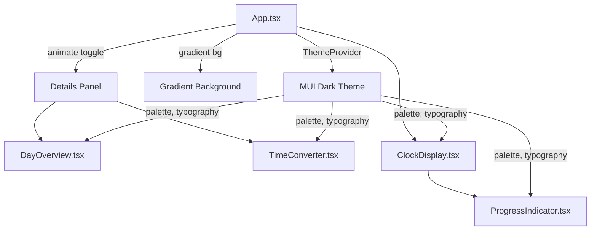

# Design Document: Beautiful UI Improvement

## Overview

This design transforms the Block Time Clock from a functional but minimal UI into a vibrant, polished dark-mode experience. The changes are purely visual — no business logic or time calculation changes. The approach modifies the existing MUI theme, component styles, and adds CSS-based animations while preserving all accessibility features.

Key design decisions:
- Use MUI's `createTheme` to centralize all color, typography, and component overrides
- Use CSS gradients and box-shadows rather than additional dependencies (no new libraries needed)
- Keep animations CSS-based via MUI's `sx` prop and CSS transitions for performance
- Maintain all existing ARIA attributes, roles, and screen-reader regions

## Architecture

The architecture remains unchanged — a single-page React app with MUI theming. The visual improvements are applied through:

1. **Theme layer** (`App.tsx`): A new dark-mode `createTheme` configuration defining the color palette, typography, and component defaults
2. **Component styling** (each component): Updated `sx` props for gradients, shadows, glow effects, and animations
3. **No new components or files** are introduced — all changes happen within existing files



## Components and Interfaces

### Theme Configuration (in App.tsx)

The existing `createTheme` call is replaced with a dark-mode theme:

```typescript
const theme = createTheme({
  palette: {
    mode: 'dark',
    primary: { main: '#7C4DFF' },      // vibrant purple
    secondary: { main: '#00E5FF' },    // cyan accent
    background: { default: '#0a0a1a', paper: '#1a1a2e' },
    text: { primary: '#E0E0E0', secondary: '#9E9E9E' },
  },
  typography: {
    fontFamily: '"Inter", "Roboto", "Helvetica Neue", sans-serif',
    h1: { fontFamily: '"JetBrains Mono", "Fira Code", monospace', fontWeight: 700 },
  },
  shape: { borderRadius: 12 },
});
```

### App.tsx Changes

- Apply a CSS linear-gradient background to the root container
- Wrap the details panel content in a `Collapse` component from MUI for smooth expand/collapse
- Animate the toggle button icon rotation on state change

### ClockDisplay.tsx Changes

- Add `textShadow` glow effect to the hex time Typography
- Use the theme's primary/secondary colors for the hex time
- Render UTC time in `text.secondary` color (muted)
- Preserve the `aria-live` region and all existing ARIA attributes

### ProgressIndicator.tsx Changes

- Replace the plain `LinearProgress` bar color with a CSS gradient using `backgroundImage` on the bar
- Add `borderRadius` to both the track and bar for rounded ends
- Set the track to a semi-transparent color (`rgba(255,255,255,0.1)`)

### DayOverview.tsx Changes

- Increase `borderRadius` on block cells
- Add `boxShadow` for elevation on all cells
- Add a glowing border/shadow on the current block cell
- Increase HSL saturation for more vivid block colors
- Wrap the grid in a fade/slide-in animation on mount

### TimeConverter.tsx Changes

- Style `TextField` inputs with dark backgrounds and light text via theme overrides
- Use accent color for labels and focus outlines
- Display conversion results in a distinct color (secondary accent)

## Data Models

No data model changes. The existing `HexTime` interface and time calculation functions remain unchanged:

```typescript
interface HexTime {
  block: number;    // 0–15
  sub: number;      // 0–15
  tick: number;     // 0–15
  hex: string;      // e.g. "1A2"
  tickProgress: number; // 0–100
}
```

The only new "data" is the theme configuration object, which is a standard MUI `ThemeOptions` — no custom types needed.


## Correctness Properties

*A property is a characteristic or behavior that should hold true across all valid executions of a system — essentially, a formal statement about what the system should do. Properties serve as the bridge between human-readable specifications and machine-verifiable correctness guarantees.*

### Property 1: Block cells have rounded corners and elevation

*For any* block index (0–15) and any block status (past, current, future), the rendered block cell should have a borderRadius greater than 0 and a non-empty boxShadow style.

**Validates: Requirements 5.1**

### Property 2: Current block is visually distinct

*For any* block index designated as "current", the rendered block cell should have a boxShadow or border style that differs from cells with "past" or "future" status, ensuring the current block is distinguishable.

**Validates: Requirements 5.2**

### Property 3: Block hue rainbow progression

*For any* pair of adjacent block indices i and i+1 (where 0 ≤ i < 15), the HSL hue of block i+1 should be greater than the hue of block i, and all hues should have saturation above 60% to ensure vivid colors.

**Validates: Requirements 5.3**

### Property 4: Typography hierarchy

*For any* pair of typography variants (h1, body1, caption) defined in the theme, the font size of the higher-level variant should be strictly greater than the lower-level variant, maintaining a consistent visual hierarchy.

**Validates: Requirements 8.3**

### Property 5: WCAG AA contrast compliance

*For any* text color and background color pair defined in the theme, the computed contrast ratio should meet the WCAG AA threshold: at least 4.5:1 for normal-sized text and at least 3:1 for large text and UI components.

**Validates: Requirements 9.2, 9.3**

## Error Handling

This feature is purely visual — there are no new error states, API calls, or data transformations. Error handling considerations:

- **Invalid theme colors**: If a color value is malformed, MUI's `createTheme` will fall back to defaults. No custom error handling needed.
- **Missing fonts**: The font stack includes fallbacks (`"Inter", "Roboto", "Helvetica Neue", sans-serif`), so missing fonts degrade gracefully.
- **Animation failures**: CSS transitions degrade gracefully — if a browser doesn't support a transition, the element simply appears/disappears without animation. No functional impact.
- **Contrast violations**: Caught by property tests during development. No runtime handling needed.

## Testing Strategy

### Unit Tests

Unit tests verify specific visual configurations and DOM structure:

- Theme defines `mode: 'dark'` with expected primary/secondary colors (Req 1.1, 1.2)
- App root element has a gradient background style (Req 2.1, 2.2)
- ClockDisplay hex time has textShadow applied (Req 3.2)
- ClockDisplay UTC time uses muted color (Req 3.3)
- ProgressIndicator bar has gradient backgroundImage and borderRadius (Req 4.1, 4.2, 4.3)
- DayOverview grid entry animation wrapper exists (Req 5.4)
- TimeConverter inputs have dark backgrounds with light text (Req 6.1, 6.2, 6.3)
- App uses MUI Collapse for details panel (Req 7.1)
- Toggle button has CSS transition (Req 7.3)
- Theme fontFamily includes sans-serif stack (Req 8.1)
- ClockDisplay hex time uses monospace font (Req 8.2)
- All existing ARIA labels and roles are preserved (Req 9.1)
- Screen-reader live region with `aria-live="polite"` exists (Req 9.4)

### Property-Based Tests

Property-based tests use `fast-check` (already in devDependencies) with minimum 100 iterations per test.

Each property test references its design document property:

- **Feature: beautiful-ui-improvement, Property 1: Block cells have rounded corners and elevation** — Generate random block indices (0–15) and statuses, verify borderRadius > 0 and boxShadow is non-empty
- **Feature: beautiful-ui-improvement, Property 2: Current block is visually distinct** — Generate random block indices, compare current block styling against past/future blocks, verify distinct shadow/border
- **Feature: beautiful-ui-improvement, Property 3: Block hue rainbow progression** — Generate pairs of adjacent block indices, verify monotonically increasing hue and saturation > 60%
- **Feature: beautiful-ui-improvement, Property 4: Typography hierarchy** — Generate pairs of typography variant levels, verify font sizes decrease with hierarchy level
- **Feature: beautiful-ui-improvement, Property 5: WCAG AA contrast compliance** — Generate all theme text/background color pairs, compute contrast ratios, verify ≥ 4.5:1 for normal text and ≥ 3:1 for large text

### Test Configuration

- Library: `fast-check` v3.23+ (already installed)
- Runner: `vitest` with `--run` flag
- Minimum iterations: 100 per property test
- Each property test tagged with: `Feature: beautiful-ui-improvement, Property {N}: {title}`
