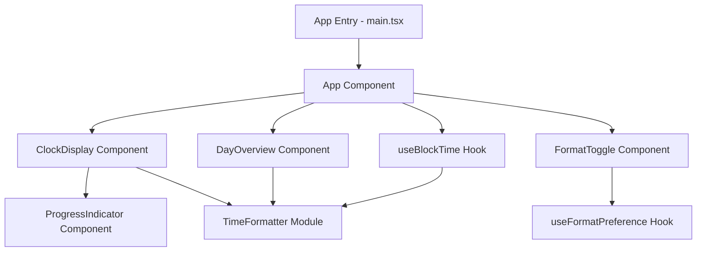

# Design Document: Block Time Clock

## Overview

Block Time Clock is a React-based single-page application that displays the current time of day using 15-minute blocks. Instead of showing exact minutes, the clock rounds time to the nearest 15-minute interval and presents it visually. The app includes a live-updating clock display, a progress indicator within the current block, a full-day overview of all 96 blocks, and support for 12-hour/24-hour format toggling with persistent preferences.

The application is built with Bun as the runtime, Vite as the build tool, React.js for the UI, MUI (Material UI) for component styling, and Vitest for testing. The architecture separates pure time-formatting logic from UI rendering to enable thorough property-based testing of the core calculation layer.

## Architecture

The application follows a layered architecture with clear separation between time calculation logic and UI presentation.



### Layer Breakdown

1. **Core Logic Layer** (`src/lib/timeFormatter.ts`)
   - Pure functions with no side effects
   - Converts `Date` objects to `BlockRepresentation`
   - Handles 12-hour/24-hour formatting
   - Calculates block progress percentage
   - Fully testable without DOM or React

2. **State Management Layer** (React hooks)
   - `useBlockTime` — manages a timer that tracks the current block and progress, updating on block boundaries
   - `useFormatPreference` — reads/writes the 12h/24h preference to `localStorage` with fallback

3. **Presentation Layer** (React + MUI components)
   - `ClockDisplay` — renders the current block label, block number, and hour
   - `ProgressIndicator` — MUI `LinearProgress` showing elapsed time within the current block
   - `DayOverview` — grid of 96 blocks with visual distinction for past, current, and future
   - `FormatToggle` — MUI `Switch` or `ToggleButtonGroup` for 12h/24h selection

## Components and Interfaces

### TimeFormatter Module (`src/lib/timeFormatter.ts`)

```typescript
export interface BlockRepresentation {
  hour: number;          // 0–23 (always stored in 24h internally)
  blockNumber: number;   // 1–4
  blockLabel: string;    // e.g., "2:15" or "14:30"
  blockStartMinute: number; // 0, 15, 30, or 45
}

export type TimeFormat = '12h' | '24h';

/** Convert a Date to its BlockRepresentation */
export function dateToBlock(date: Date, format: TimeFormat): BlockRepresentation;

/** Format a block label string given hour and block start minute */
export function formatBlockLabel(hour: number, blockStartMinute: number, format: TimeFormat): string;

/** Calculate progress (0–100) within the current block */
export function blockProgress(date: Date): number;

/** Parse a block label back to a Date (for round-trip validation) */
export function parseBlockLabel(label: string, format: TimeFormat): Date;

/** Get the block number (1–4) for a given minute value (0–59) */
export function minuteToBlockNumber(minute: number): number;

/** Get the block start minute for a given block number */
export function blockNumberToStartMinute(blockNumber: number): number;

/** Generate all 96 block representations for a full day */
export function generateDayBlocks(format: TimeFormat): BlockRepresentation[];
```

### useBlockTime Hook (`src/hooks/useBlockTime.ts`)

```typescript
interface BlockTimeState {
  currentBlock: BlockRepresentation;
  progress: number;       // 0–100
  currentDate: Date;
}

export function useBlockTime(format: TimeFormat): BlockTimeState;
```

- Sets up an interval (every ~1 second) to check the current time
- Recalculates `BlockRepresentation` and progress on each tick
- Cleans up the interval on unmount

### useFormatPreference Hook (`src/hooks/useFormatPreference.ts`)

```typescript
export function useFormatPreference(): [TimeFormat, (format: TimeFormat) => void];
```

- Reads initial value from `localStorage` key `"blockTimeClock.format"`
- Falls back to `'12h'` if `localStorage` is unavailable or key is missing
- Persists changes to `localStorage`, silently catching errors

### ClockDisplay Component (`src/components/ClockDisplay.tsx`)

- Renders the `BlockLabel` prominently
- Shows "Block X of 4" text
- Contains the `ProgressIndicator`
- Uses an `aria-live="polite"` region to announce block changes

### ProgressIndicator Component (`src/components/ProgressIndicator.tsx`)

- Wraps MUI `LinearProgress` in determinate mode
- Receives `progress` (0–100) as a prop
- Includes `aria-label` and `aria-valuenow` for accessibility

### DayOverview Component (`src/components/DayOverview.tsx`)

- Renders a grid of 96 cells (24 hours × 4 blocks)
- Accepts `currentBlock` to determine past/current/future styling
- Uses MUI `Box` or `Grid` with responsive breakpoints
- Each cell has an accessible label (e.g., "Block 2 of hour 14, past")

### FormatToggle Component (`src/components/FormatToggle.tsx`)

- MUI `ToggleButtonGroup` with "12h" and "24h" options
- Calls the setter from `useFormatPreference` on change

### App Component (`src/App.tsx`)

- Composes all components
- Manages format state via `useFormatPreference`
- Passes format to `useBlockTime` and child components
- Wraps content in MUI `ThemeProvider` and `CssBaseline`

## Data Models

### BlockRepresentation

| Field              | Type     | Description                                  |
|--------------------|----------|----------------------------------------------|
| `hour`             | `number` | Hour in 24h format (0–23), always internal   |
| `blockNumber`      | `number` | Block within the hour (1–4)                  |
| `blockLabel`       | `string` | Human-readable label, e.g., "2:30 PM"        |
| `blockStartMinute` | `number` | Start minute of the block (0, 15, 30, or 45) |

### TimeFormat

A union type `'12h' | '24h'` used throughout the application to control display formatting.

### Block Mapping

| Minute Range | Block Number | Block Start Minute |
|-------------|-------------|-------------------|
| 0–14        | 1           | 0                 |
| 15–29       | 2           | 15                |
| 30–44       | 3           | 30                |
| 45–59       | 4           | 45                |

### localStorage Schema

| Key                        | Value Type | Default | Description                    |
|----------------------------|-----------|---------|--------------------------------|
| `blockTimeClock.format`    | `string`  | `"12h"` | User's preferred time format   |


## Correctness Properties

*A property is a characteristic or behavior that should hold true across all valid executions of a system — essentially, a formal statement about what the system should do. Properties serve as the bridge between human-readable specifications and machine-verifiable correctness guarantees.*

### Property 1: Block mapping invariant

*For any* valid `Date`, calling `dateToBlock` shall return a `BlockRepresentation` where `hour` is in [0, 23], `blockNumber` is in [1, 4], `blockStartMinute` is one of {0, 15, 30, 45}, and `blockStartMinute` equals `(blockNumber - 1) * 15`. Additionally, the `blockNumber` must correspond to the minute of the input Date: minutes 0–14 → block 1, 15–29 → block 2, 30–44 → block 3, 45–59 → block 4.

**Validates: Requirements 1.1, 1.2**

### Property 2: Block label format

*For any* valid `Date` and any `TimeFormat`, the `blockLabel` returned by `dateToBlock` shall contain a minute portion that is exactly one of "00", "15", "30", or "45", matching the `blockStartMinute` of the returned `BlockRepresentation`.

**Validates: Requirements 1.3**

### Property 3: Block format-parse round-trip

*For any* valid `Date` and any `TimeFormat`, formatting the Date to a `BlockRepresentation` via `dateToBlock` and then parsing the resulting `blockLabel` back via `parseBlockLabel` shall produce a Date whose `hour` and `blockNumber` (when converted back via `dateToBlock`) are identical to the original `BlockRepresentation`.

**Validates: Requirements 1.4**

### Property 4: Progress within valid range

*For any* valid `Date`, `blockProgress(date)` shall return a number in the range [0, 100]. Furthermore, the progress value shall equal `((minute % 15) * 60 + seconds) / 900 * 100`, where `minute` and `seconds` are extracted from the input Date.

**Validates: Requirements 3.1**

### Property 5: Day overview completeness

*For any* `TimeFormat`, `generateDayBlocks(format)` shall return exactly 96 `BlockRepresentation` items, covering every combination of hours 0–23 and block numbers 1–4, with no duplicates and no gaps.

**Validates: Requirements 4.1**

### Property 6: Block temporal classification consistency

*For any* current `Date` and any block in the day overview, the block shall be classified as exactly one of "past", "current", or "future". All blocks before the current block in chronological order shall be "past", the block matching the current time shall be "current", and all blocks after shall be "future".

**Validates: Requirements 4.2**

### Property 7: Format-specific label rules

*For any* valid `Date`, when `TimeFormat` is `'24h'`, the hour portion of the `blockLabel` shall be in the range [0, 23] and the label shall not contain "AM" or "PM". When `TimeFormat` is `'12h'`, the hour portion shall be in the range [1, 12] and the label shall contain exactly one of "AM" or "PM".

**Validates: Requirements 5.2, 5.3**

### Property 8: Format preference persistence round-trip

*For any* `TimeFormat` value (`'12h'` or `'24h'`), saving the preference to localStorage and then reading it back shall return the same `TimeFormat` value that was saved.

**Validates: Requirements 5.4, 5.5**

## Error Handling

### System Time Unavailable

- If `new Date()` throws or returns an invalid date, the `useBlockTime` hook catches the error and sets an `error` state.
- The `ClockDisplay` component renders a user-friendly message: "Unable to determine the current time" instead of the clock.
- The app remains interactive (format toggle still works) so the user can retry or refresh.

### localStorage Unavailable

- The `useFormatPreference` hook wraps all `localStorage` calls in try/catch.
- On read failure: returns the default `'12h'` format silently.
- On write failure: the preference change still applies to the in-memory React state for the current session, but won't persist across reloads.
- No error message is shown to the user.

### Invalid localStorage Data

- If the stored format value is not `'12h'` or `'24h'`, the hook treats it as missing and falls back to `'12h'`.

### Component Error Boundary

- A React error boundary wraps the main app to catch unexpected rendering errors and display a fallback UI rather than a blank screen.

## Testing Strategy

### Testing Framework

- **Unit & Property Tests**: Vitest with `fast-check` for property-based testing
- **Component Tests**: Vitest with `@testing-library/react` and `@testing-library/jest-dom`

### Property-Based Tests (`src/lib/__tests__/timeFormatter.test.ts`)

Each correctness property from the design is implemented as a single property-based test using `fast-check`. Each test runs a minimum of 100 iterations.

Tests are tagged with comments referencing the design property:

```
// Feature: block-time-clock, Property 1: Block mapping invariant
// Feature: block-time-clock, Property 2: Block label format
// Feature: block-time-clock, Property 3: Block format-parse round-trip
// Feature: block-time-clock, Property 4: Progress within valid range
// Feature: block-time-clock, Property 5: Day overview completeness
// Feature: block-time-clock, Property 6: Block temporal classification consistency
// Feature: block-time-clock, Property 7: Format-specific label rules
// Feature: block-time-clock, Property 8: Format preference persistence round-trip
```

Generators:
- `fc.date()` for random Date values
- `fc.constantFrom('12h', '24h')` for TimeFormat
- `fc.integer({ min: 0, max: 59 })` for minute values
- `fc.integer({ min: 0, max: 23 })` for hour values

### Unit Tests

Unit tests complement property tests by covering:

- **Specific examples**: Known dates with expected block outputs (e.g., 2:37 PM → Block 3, label "2:30 PM")
- **Edge cases**: Midnight (0:00), end of day (23:59), block boundaries (exactly :00, :15, :30, :45)
- **Error conditions**: Invalid Date, unavailable localStorage (mocked), malformed localStorage data
- **Component rendering**: ClockDisplay renders aria-live region, ProgressIndicator has correct aria attributes, DayOverview renders 96 cells
- **Default behavior**: App defaults to 12h format when no preference is stored

### Test File Organization

```
src/
  lib/
    __tests__/
      timeFormatter.test.ts        # Property + unit tests for core logic
  hooks/
    __tests__/
      useFormatPreference.test.ts  # Unit tests for localStorage hook
      useBlockTime.test.ts         # Unit tests for timer hook
  components/
    __tests__/
      ClockDisplay.test.tsx        # Component rendering tests
      DayOverview.test.tsx         # Component rendering tests
```
