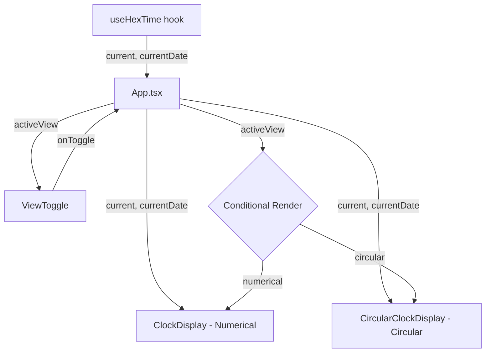

# Design Document: Clock View Toggle

## Overview

This feature adds an alternate circular (analog-style) clock view to the Hexflow Clock app and a toggle control to switch between the existing numerical display and the new circular display. The circular view represents hex time using three concentric SVG arcs for block, sub-block, and tick values, with the hex string centered inside. The toggle lives near the clock and preserves the existing `useHexTime` hook as the single source of truth for time data.

### Key Design Decisions

- **SVG over Canvas**: SVG is chosen for the circular view because it integrates naturally with React's declarative rendering, supports CSS transitions for smooth tick animation, and is inherently accessible (supports `aria-label`, `role`, `<title>` elements). Canvas would require imperative drawing and manual accessibility handling.
- **State lives in App.tsx**: The active view state (`'numerical' | 'circular'`) is managed in `App.tsx` alongside the existing `showDetails` state. This keeps `ClockDisplay` and the new `CircularClockDisplay` as pure presentational components receiving `HexTime` props.
- **No localStorage persistence for view preference**: The requirement specifies defaulting to numerical on load. Persistence can be added later if needed.

## Architecture



The `useHexTime` hook continues running unconditionally in `App.tsx`. The `activeView` state determines which display component renders. Both display components receive the same `HexTime` props, so switching views always shows current time with zero delay.

## Components and Interfaces

### ViewToggle Component

**File**: `src/components/ViewToggle.tsx`

```typescript
interface ViewToggleProps {
  activeView: 'numerical' | 'circular';
  onToggle: () => void;
}
```

- Renders two icon buttons (or a segmented control) indicating numerical vs circular view
- Highlights the active view visually
- Keyboard accessible: responds to Enter and Space
- `aria-label` dynamically describes the action (e.g., "Switch to circular view")

### CircularClockDisplay Component

**File**: `src/components/CircularClockDisplay.tsx`

```typescript
interface CircularClockDisplayProps {
  current: HexTime;
  currentDate: Date;
}
```

- Renders an SVG with three concentric arc paths:
  - **Outer ring**: Block arc, sweep = `(block / 16) * 360°`
  - **Middle ring**: Sub-block arc, sweep = `(sub / 16) * 360°`
  - **Inner ring**: Tick arc, sweep = `((tick + tickProgress / 100) / 16) * 360°`
- Center text shows `current.hex`
- Uses the purple-to-cyan gradient via SVG `<linearGradient>` definitions
- Responsive sizing via `useMediaQuery` or CSS: ~280px diameter on mobile (<600px), ~360px on desktop
- Includes `aria-label` on the SVG element with current hex time and local time
- Includes a visually hidden `aria-live="polite"` region for screen reader announcements

### Arc Calculation Utility

**File**: `src/lib/arcUtils.ts`

```typescript
interface ArcPath {
  d: string;        // SVG path d attribute
  startAngle: number;
  endAngle: number;
}

function describeArc(
  cx: number, cy: number, radius: number,
  startAngle: number, endAngle: number
): string;

function hexTimeToArcs(
  current: HexTime, cx: number, cy: number,
  radii: { block: number; sub: number; tick: number }
): { block: ArcPath; sub: ArcPath; tick: ArcPath };
```

- `describeArc`: Generates an SVG arc path `d` string given center, radius, and angles. Handles the special case where endAngle ≈ startAngle (zero-length arc returns empty string) and where the arc spans ≥ 360° (full circle).
- `hexTimeToArcs`: Converts `HexTime` values to three arc paths. All arcs start at 12 o'clock (-90°). The tick arc interpolates using `tickProgress` for smooth animation.

### Modified App.tsx

- Adds `activeView` state: `useState<'numerical' | 'circular'>('numerical')`
- Renders `ViewToggle` above the clock display area
- Conditionally renders `ClockDisplay` or `CircularClockDisplay` based on `activeView`

### Existing ClockDisplay

No changes needed. It continues to receive `current` and `currentDate` props as before.

## Data Models

### View State

```typescript
type ClockViewMode = 'numerical' | 'circular';
```

A simple union type. No new data structures are needed beyond this. The existing `HexTime` interface already provides all data both views need:

```typescript
// Existing - no changes
interface HexTime {
  block: number;    // 0–15
  sub: number;      // 0–15
  tick: number;     // 0–15
  hex: string;      // e.g. "1A2"
  tickProgress: number; // 0–100
}
```

### Arc Geometry

```typescript
interface ArcGeometry {
  cx: number;       // center x
  cy: number;       // center y
  radius: number;   // arc radius
  startAngle: number; // degrees, 0 = 12 o'clock
  endAngle: number;   // degrees
}
```

Used internally by `describeArc` and `hexTimeToArcs`. Not exported as a public API — the components consume SVG path strings directly.


## Correctness Properties

*A property is a characteristic or behavior that should hold true across all valid executions of a system — essentially, a formal statement about what the system should do. Properties serve as the bridge between human-readable specifications and machine-verifiable correctness guarantees.*

### Property 1: Toggle alternation

*For any* non-negative integer N representing the number of times the toggle is activated from the default state, the active view should be `'numerical'` when N is even and `'circular'` when N is odd.

**Validates: Requirements 1.2**

### Property 2: Arc sweep angles match hex time values

*For any* valid HexTime (block 0–15, sub 0–15, tick 0–15, tickProgress 0–100), the `hexTimeToArcs` function should produce:
- Block arc sweep angle = `(block / 16) * 360`
- Sub-block arc sweep angle = `(sub / 16) * 360`
- Tick arc sweep angle = `((tick + tickProgress / 100) / 16) * 360`

**Validates: Requirements 2.2, 2.3, 2.4, 3.1**

### Property 3: Center text matches hex string

*For any* valid HexTime, the CircularClockDisplay should render an SVG `<text>` element whose content equals `current.hex`.

**Validates: Requirements 2.5**

### Property 4: Accessible label contains hex time and local time

*For any* valid HexTime and corresponding Date, the CircularClockDisplay's SVG `aria-label` should contain both the hex time string and the formatted local time string.

**Validates: Requirements 5.1**

### Property 5: Toggle accessible name reflects current state

*For any* active view state (`'numerical'` or `'circular'`), the ViewToggle's accessible name should describe switching to the opposite view (e.g., when numerical is active, the label should reference switching to circular, and vice versa).

**Validates: Requirements 5.3**

## Error Handling

### Edge Cases in Arc Calculation

- **Zero values** (block=0, sub=0, tick=0): `describeArc` returns an empty path string when the sweep angle is 0. The SVG renders no visible arc, which is correct — at the start of a cycle, no progress has been made.
- **Maximum values** (block=15, sub=15, tick=15, tickProgress≈100): The arc approaches but never reaches a full 360° circle (max is 15/16 * 360 = 337.5° for block/sub, slightly more for tick with progress). The `describeArc` function handles arcs up to but not including 360° using the standard large-arc-flag SVG logic.
- **tickProgress boundary**: `tickProgress` is clamped to 0–100 by the `dateToHex` function. The arc calculation handles 0 and 100 correctly without special casing.

### Toggle State

- The toggle state is a simple binary — no invalid states are possible with the `'numerical' | 'circular'` union type.
- If the component unmounts and remounts, it defaults to `'numerical'` per requirement 1.4.

### SVG Rendering

- If `HexTime` values are somehow out of range (defensive), `describeArc` clamps angles to [0, 360) to prevent rendering artifacts.

## Testing Strategy

### Unit Tests

Unit tests verify specific examples, edge cases, and structural requirements:

- **ViewToggle renders and defaults to numerical** (Req 1.1, 1.4)
- **ViewToggle responds to keyboard events** (Enter, Space) (Req 1.5)
- **CircularClockDisplay renders SVG element when active** (Req 2.1)
- **Tick arc has CSS transition for smooth animation** (Req 3.2)
- **CircularClockDisplay has aria-live region** (Req 5.2)
- **Responsive sizing: smaller diameter below 600px** (Req 4.2)
- **describeArc returns empty string for zero sweep angle** (edge case)
- **describeArc handles near-360° arcs correctly** (edge case)

### Property-Based Tests

Property-based tests use `fast-check` (already in devDependencies) with minimum 100 iterations per property. Each test references its design property.

- **Feature: clock-view-toggle, Property 1: Toggle alternation** — Generate random non-negative integers, simulate that many toggles, verify the resulting view state.
- **Feature: clock-view-toggle, Property 2: Arc sweep angles match hex time values** — Generate random valid HexTime objects (block/sub/tick 0–15, tickProgress 0–100), call `hexTimeToArcs`, verify all three sweep angles match the formulas.
- **Feature: clock-view-toggle, Property 3: Center text matches hex string** — Generate random valid HexTime objects, render CircularClockDisplay, verify the SVG text content equals `current.hex`.
- **Feature: clock-view-toggle, Property 4: Accessible label contains hex time and local time** — Generate random HexTime + Date pairs, render CircularClockDisplay, verify the aria-label contains both strings.
- **Feature: clock-view-toggle, Property 5: Toggle accessible name reflects current state** — Generate random view states, render ViewToggle, verify the accessible name references the opposite view.

### Test Configuration

- Library: `fast-check` v3.23.0 (already installed)
- Runner: `vitest` with `--run` flag
- Minimum iterations: 100 per property test (`{ numRuns: 100 }`)
- Each property test tagged with: `Feature: clock-view-toggle, Property {N}: {title}`
- Test files:
  - `src/components/__tests__/ViewToggle.test.tsx` — unit + property tests for toggle
  - `src/components/__tests__/CircularClockDisplay.test.tsx` — unit + property tests for circular display
  - `src/lib/__tests__/arcUtils.test.ts` — property tests for arc calculation (Property 2)
